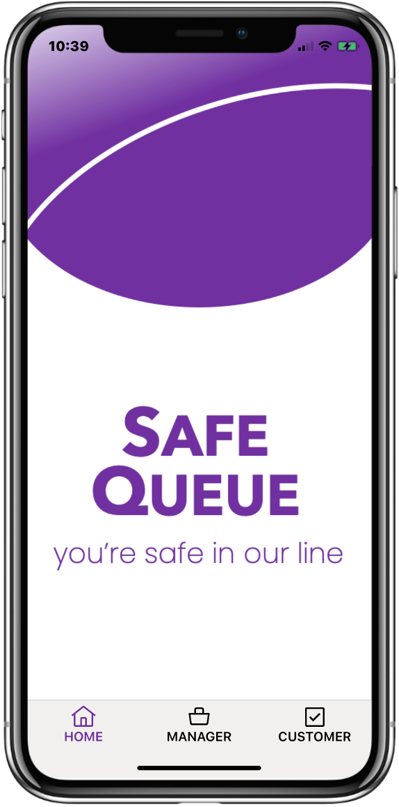
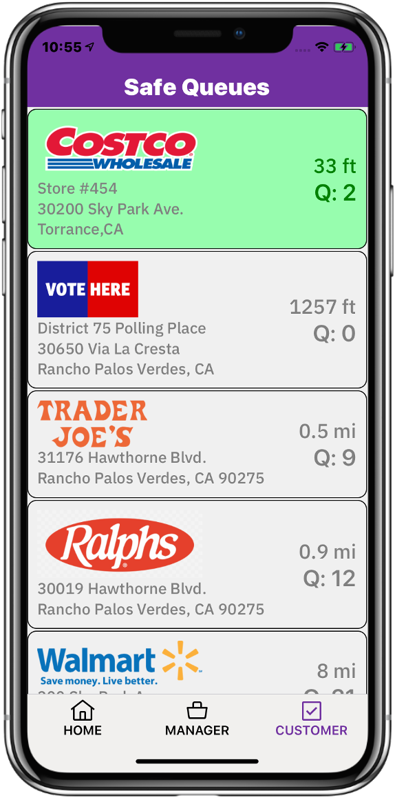
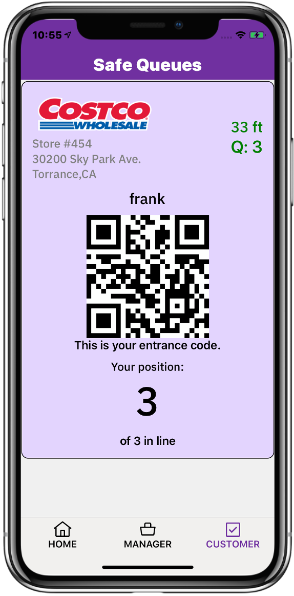
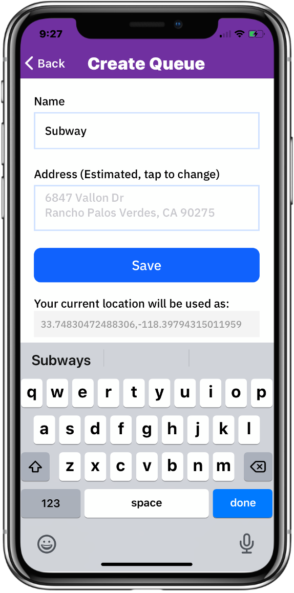
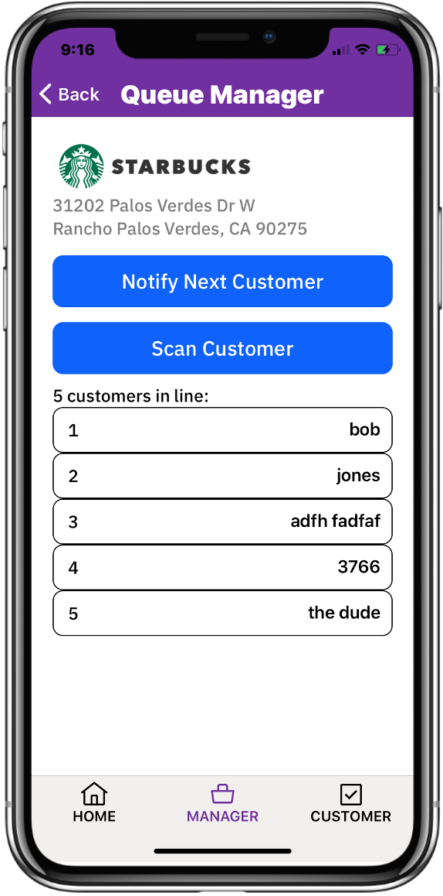
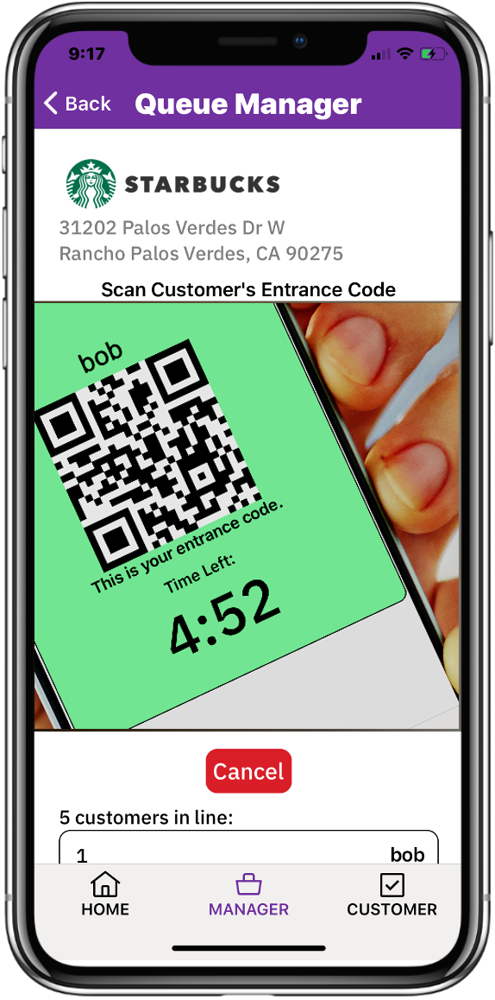

# Safe-Queue

## Authors

- Dave Chura
- Anthony Amanse
- Daniel Krook

## Contents

1. [Overview](#overview)
2. [The idea](#the-idea)
3. [How it works](#how-it-works)
4. [Use Cases](#use-cases)
5. [Production Release](#production-release)
6. [Analytics](#analytics)

## Overview

### What's the problem?

COVID-19 has changed everyone's lives and social distancing has created a new environment for stores, polling places, restaurants and businesses of all kinds.  The need to limit entry has created long lines of people at least 6 feet apart, who must stand for long times outside in hot and cold weather.  This is not just an inconvenience; it contributes to spread of the disease, discourages necessary shopping and could affect our democracy as shown in the Wisconsin Election,  where lines reached several hours long.  Below are pictures of the problem at a Costco and at a Wisconsin polling place:

This is a problem that can impact thousands of businesses and possibly millions of people every single day.  Lines such as these discourage shopping, voting, take-out eating, and prevent older or more handicapped persons from participating. Given the large number of people in these lines every day, this has potential for spreading the disease despite efforts to distance.

The intent of Safe Queue is to solve this immediate problem immediately.  

In addition, because Safe Queue provides a value to consumers, it can be also be the means to collect (anonymous) data necessary for future analytics to understand human behavior in times of COVID-19 now and ahead. It may even inform and measure the process for returning to normalcy.

### How can technology help?

Of course, physical lines can be replaced by virtual lines, where people do not have to be physically in a line to "be in line". Virtual lines are "safe" because you are not near anyone while waiting, don't need masks or gloves while waiting, and aren't subject to bad weather (hot or cold) or  standing up. Even businesses with limited parking (such as a restaurants now doing all take-out) can take advantage of safe lines.

<b>We call each virtual line a "Safe Queue"</b>.

There are already many "reservation" systems available today, however these do not address the ad-hoc nature of shopping where the time taken by a customer in a store varies widely and the time they go is not planned. People want to go to stores when they want to go, and spend the time they need. As such, reservation systems cannot handle the on-demand nature of shopping (and voting) that people see as "normal". This kind of behavior cannot be reserved effectively and businesses cannot schedule such behavior effectively. In these COVID-19 times, restoring the ability to just go to the store brings back a sense of normalcy, and a safe queue can help do so while preventing spread of the disease.

Furthermore, reservation systems are hard to use, including sign-ups, emails, calendars, time-slots, personal information, and a promise to show up in the future, which must be managed by businesses.  Stores (e.g. Costco) will find it impossible to use reservation systems for on-demand shopping; Polling places will find it impossible to create reservations for voting - voting is a right, and missing your reservation isn't a viable option for democracy.

<b>SAFE QUEUE IS COMPLETELY DIFFERENT FROM A RESERVATION SYSTEM.</b>

## The idea

<b>SAFE QUEUE IS A COMPLETELY DIFFERENT IDEA THAN A RESERVATION SYSTEM</b>. It does create virtual lines ("safe queues") but it directly solves the on-demand nature that consumers want as normal for shopping. It does so with a unique combination of technologies that result in queuing that is simple and safe in COVID-19 times, both for consumers and employees.  It eliminates the problems characterized by the lines in the pictures above.

Safe Queue is an amazingly easy to use App that for both the business (or polling place) and the consumer.   There is no sign up required for consumers or for businesses, so it can be used immediately upon download. Absolutely no personal information is required, and consumers can be in line at a business within seconds of downloading the app to their devices.   Consumers use the app to join "safe queues" and businesses use the app to manage entry into their business.   A business can have as many safe queues as they want, managing each independently.

Safe Queue is realized as a mobile app with cloud services (including computing, middleware, databases, push notifications, geolocation, geocoding). The mobile app is implemented in react-native and all cloud services have been tested in the IBM Cloud.  <b>Safe Queue was developed from the Community starter kit supplied by IBM as part of the 2020 Call For Code Global Challenge to take on COVID-19.</b>

## How it works

<b>The primary element of Safe Queue is GPS location.</b>  The app uses your GPS location as a condition for entering the 'safe queue' of a business.  A consumer can enter a line for a business if he is located within 1000 feet of the business.  It doesn't matter who you are, as long as you are nearby and stay nearby. Typically you will be waiting in your car where you are 'safe' rather than standing outside in a line with lots of other people, subject to spread of the virus, the weather (hot or cold) and ability to stand for a long time. If you drive away from the business, you are removed from the line automatically by the App.  The app provides directions to businesses and clearly shows when you can get in line at a business (i.e. you are close enough to it)

A business creates a 'safe queue' for itself using the same App. The manager (or employee) creates the queue, where the GPS location of that person becomes the location used for the business.  This becomes published where consumers see it in their Apps (based upon their location).  The app reverse-geocodes the location into an address so the business does not need to enter (though it can edit it).  Once created, an employee of the business controls the actual entry of people with a few simple buttons. Anyone who shows up long before opening hours can get in line, provided they stay close to the business!  Note that a business can create several safe queues, perhaps segregating them by entrance location (e.g. contractor vs. consumer), by age (e.g. over 65 line), or by type (e.g. Instacart shoppers vs individuals)

<b>Another key element of Safe Queue is a QR-Code.</b>  The identity of persons in line is encapsulated in a randomly-generated QR Code by the App,  which is scanned by the business to validate entry.  This requires nothing from the user, so is super-easy to use. In addition, it is completely anonymous, as consumers expect when shopping.

<b>Another key element of Safe Queue is Push Notifications.</b>  The employee at the business manages the line using the Safe Queue App, and notifies consumers when they should come in. The system automatically notifies the next few people in line that their time is coming soon.  There is no texting, cell phone numbers or any other personal information used, so this is again super easy for consumers and anonymous as well.

<b>The last key element of Safe Queue is Voice Alerts.</b> Consumers get typical notifications through texting or notifications, but Safe Queue adds brief audio to them.  Instead of a ding, they hear a short message like: "This is Safe Queue, you are next in line".  Consumers do not have to watch their phones continuously and can do other things while waiting. The voice alert is much more user friendly.

See the screenshots and detailed use cases below. There is also a <b>the video demonstrating Safe Queue in action </b>
<a href="http://www.enclayvegroup.com/safequeue_demo.mp4">here</a> and in the videos folder of this project.

## Use Cases

<b>1. A CONSUMER GOES TO A STORE</b>: A consumer wants to go to Costco for a number of items.  He opens up Safe Queue, taps on 'CUSTOMER' and sees his Costco has a 'safe queue' (and also sees the number of people in line). Great, he isn't close to the store, so can't get in line yet. He drives to the Costco and when he gets close enough (1000 feet) to the store, his app turns green for Costco. He taps on it (it is an obvious large green area), confirms, and he's entered into the line. He parks his car and waits there, safe and sound.

<table style="width:100%; border:0;">
<colgroup>
      <col span="1" style="width: 20%;">
      <col span="1" style="width: 30%;">
      <col span="1" style="width: 20%;">
      <col span="1" style="width: 30%;">
   </colgroup>
   <tbody>
<tr>
<th>
Tap on 'CUSTOMER'. A list of published safe queues ordered by distance  appears. One of more are green, indicating you are close enough to join that safe queue.
</th>
<th>

</th>
<th>
Tap the a green  entry, which confirms you want to join the safe queue and enter an optional nickname. 'frank' was typed in this case.
</th>
<th>

</th>
</tr>
</trbody>
</table>

As his turn in line approaches, he receives push notifications with audio alerts starting at fourth in line and including:  "this is Safe Queue, you are now second in line" so he can get ready,  and then finally: "this is safe queue, you can go in now.".  

He leaves his car and goes in, shows his QR Code to the employee who scans it (also using the App) which confirms he is the next one in line.  The successful scan then removes him from the line and notifications go out to everyone else waiting.

<b>2. A BUSINESS CREATES A SAFE QUEUE</b>:  A manager (or employee) of a business opens up the Safe Queue App, taps on "MANAGER" and sees an empty list. He taps on Add and enters the business name, an optional logo, and an address (though this is pre-populated by the App from the GPS location).  He then taps on Save, which publishes this for consumers to find (as per CONSUMER use case above).

He then see a list, which includes what he created. He taps on it to manage it (see BUSINESS MANAGE use case below).  
Note that a business can have as many safe queues at their location as they want, each managed by one or more employees.

<b>3. A BUSINESS MANAGES ENTRY TO A STORE</b>:
After having create a safe queue (see use case above), an employee at an entrance to the store uses the app to control entry.

<table style="width:100%; border:0;">
<colgroup>
      <col span="1" style="width: 20%;">
      <col span="1" style="width: 30%;">
      <col span="1" style="width: 20%;">
      <col span="1" style="width: 30%;">
   </colgroup>
   <tbody>
<tr>
<th>
The employee sees the safe queue. To let someone in, he taps on the "Notify Next Customer". When the customer just notified arrives, he taps on "Scan Customer" which opens the scanner.
</th>
<th>

</th>
<th>
Scanning the QR-Code, the app verifies he is next in safe queue, which removes him from the line and notifies others they have moved up (with an audio alert).
</th>
<th>

</th>
</tbody>
</table>

## Production Release

#### Safe Queue is intended to be deployed right now!
Safe Queue is a functional prototype for iOS devices (via react-native) using the IBM Cloud and can be deployed worldwide with small effort per the estimated work below.</b>

The following are needed for widespread production deployment:

1. Required features to be developed
- add push notifications for Android
- add EULA and privacy policy
- add beta-test code support (to support explicit enabling of beta test businesses)

2. Optional features to be developed
- (optional) complete the turn-by-turn driving directions.

3. Production Cloud Instantiation
- create necessary account at IBM Cloud and billing
- configure for increased scalability

4. App deployment to app stores
- create necessary accounts at Apple/Google/etc.
- submit production app to Apple for approval
- submit production app to Google and optionally other app stores

## Analytics
The intent of Save Queue today is to solve an immediate problem immediately. However, it provides the means to collect a large amount of anonymous data about consumers, stores, travel and lines. This is a unique data set unique to these COVID-19 times because these kind of lines have never existed before.

Note that the Scan Queue app delivers a valuable service to consumers, so is the only reason why this data would become available for analysis. Should that data be kept in the cloud (today it is not kept longer than needed), one might be able to understand some of the following:
* how many people are really affected
* how long people wait in lines (which could be useful to users)
* how different regions are effected differently
* when people shop
* what stores people find necessary
* when people abandon lines
* where stores need to be located to ease
* much more...

## License
Portions of this software originated from the Community starter kit supplied by IBM as part of the 2020 Call For Code Global Challenge to take on COVID-19, which include the following notice:

Copyright (c) Facebook, Inc. and its affiliates.
 * This source code is licensed under the MIT license found in the
 * LICENSE file in the root directory of this source tree.

Other portions of this software were developed by enclayve Group, LLC and include the following notice:

Copyright 2020 ENCLAYVE GROUP LLC

   Licensed under the Apache License, Version 2.0 (the "License");
   you may not use any file except in compliance with the License.
   You may obtain a copy of the License at

       http://www.apache.org/licenses/LICENSE-2.0

   Unless required by applicable law or agreed to in writing, software
   distributed under the License is distributed on an "AS IS" BASIS,
   WITHOUT WARRANTIES OR CONDITIONS OF ANY KIND, either express or implied.
   See the License for the specific language governing permissions and
   limitations under the License.
