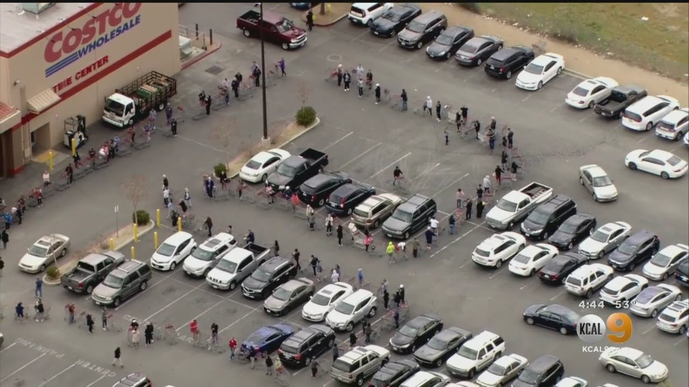
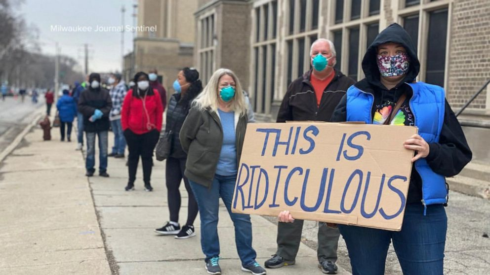
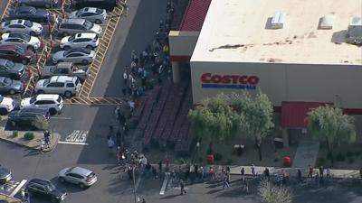
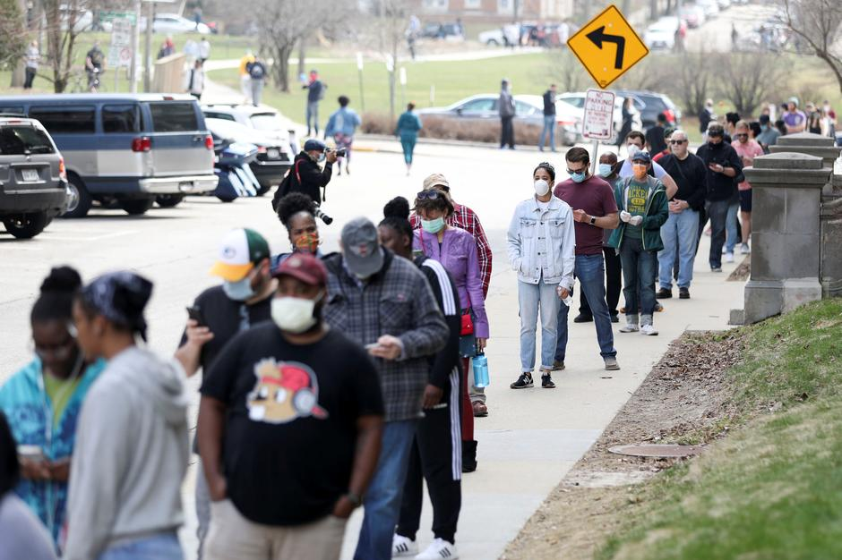
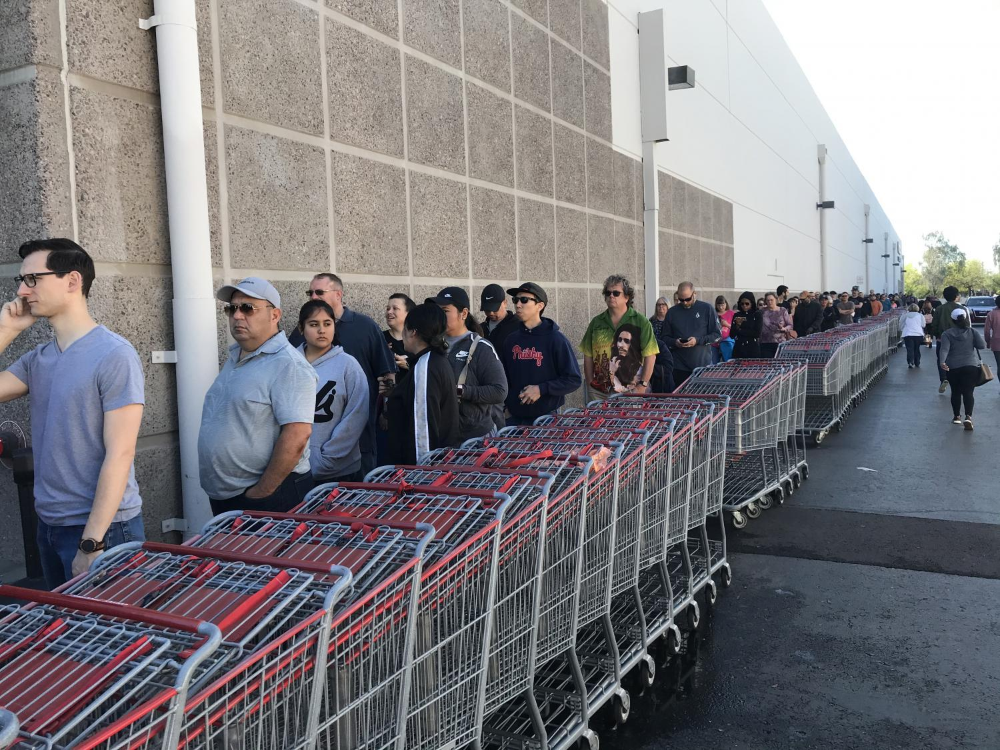
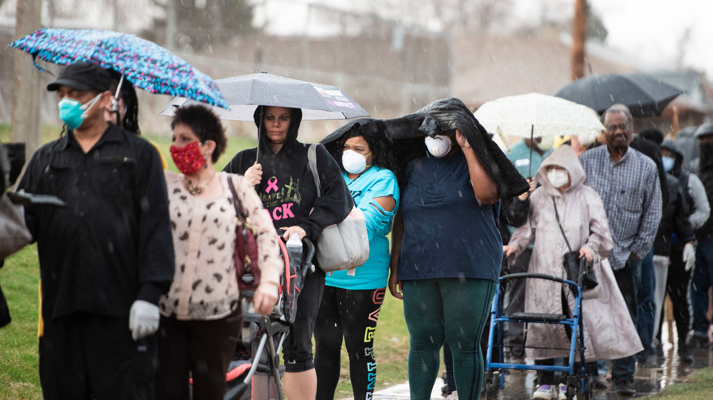
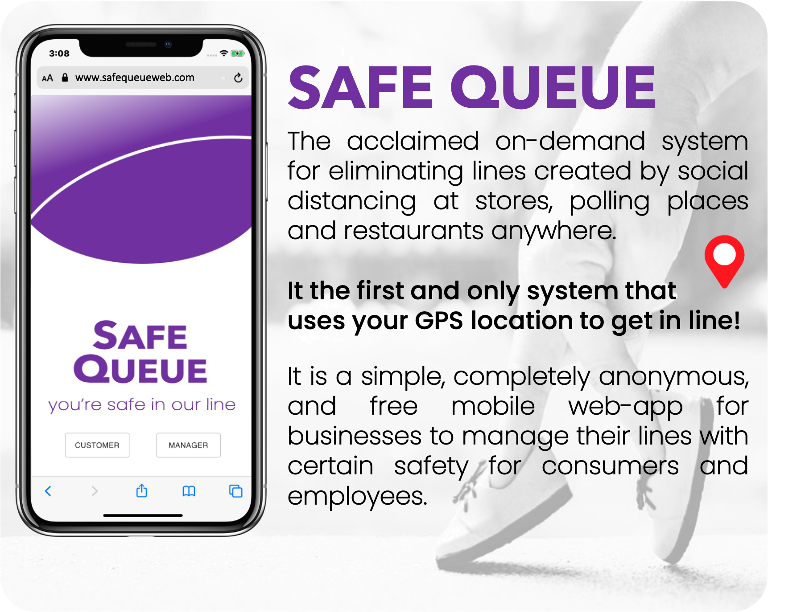
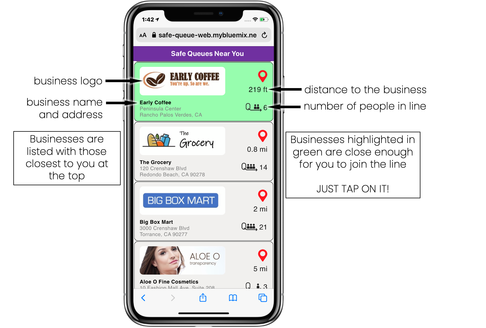
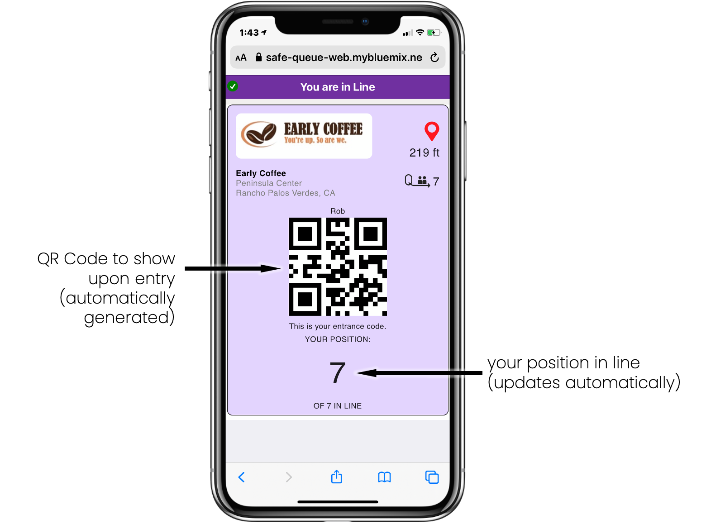
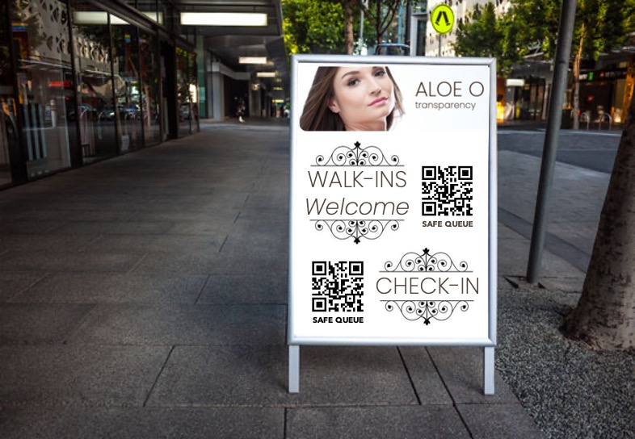

# Safe-Queue

 

## Authors

- Dave Chura
- Anthony Amanse
- Daniel Krook

## Contents

1. [Overview](#overview)
2. [The idea](#the-idea)
3. [How it works](#how-it-works)
4. [Use Cases](#use-cases)

## Overview

### What's the problem?

COVID-19 has changed everyone's lives and social distancing has created a new environment for stores, polling places, restaurants and businesses of all kinds.  The need to limit entry has created long lines of people at least 6 feet apart, who must stand for long times outside in hot and cold weather.  This is not just an inconvenience; it contributes to spread of the disease, discourages necessary shopping and could affect our democracy as shown in the Wisconsin Election,  where lines reached several hours long.  Below are pictures of the problem at a Costco and at a Wisconsin polling place:

This is a problem that can impact thousands of businesses and possibly millions of people every single day.  Lines such as these discourage shopping, voting, take-out eating, and prevent older or more handicapped persons from participating. Given the large number of people in these lines every day, this has potential for spreading the disease despite efforts to distance.

The intent of Safe Queue is to solve this immediate problem immediately.  

In addition, because Safe Queue provides a value to consumers, it can be also be the means to collect (anonymous) data necessary for future analytics to understand human behavior in times of COVID-19 now and ahead. It may even inform and measure the process for returning to normalcy.

### How can technology help?

Of course, physical lines can be replaced by virtual lines, where people do not have to be physically in a line to "be in line". Virtual lines are "safe" because you are not near anyone while waiting, don't need masks or gloves while waiting, and aren't subject to bad weather (hot or cold) or  standing up. Even businesses with limited parking (such as a restaurants now doing all take-out) can take advantage of safe lines.

<b>We call each virtual line a "Safe Queue"</b>.

<b>SAFE QUEUE IS COMPLETELY DIFFERENT FROM A RESERVATION SYSTEM.</b>

There are already many "reservation" systems available today, however these do not address the ad-hoc nature of shopping where the time taken by a customer in a store varies widely and when they want to go is not planned. People want to go to stores when they want to go, and spend the time they need. As such, reservation systems cannot handle the on-demand nature of shopping (and voting) that people see as "normal". This kind of behavior cannot be reserved effectively and businesses cannot schedule such behavior effectively. In these COVID-19 times, restoring the ability to just go to the store brings back a sense of normalcy, and a safe queue can help do so while preventing spread of the disease.

Furthermore, reservation systems are hard to use, including sign-ups, emails, calendars, time-slots, personal information, and a promise to show up in the future, which must be managed by businesses.  Stores will find it impossible to use reservation systems for on-demand shopping; Polling places will find it impossible to create reservations for voting - voting is a right, and missing your reservation isn't a viable option for democracy.

## The idea

<b>SAFE QUEUE IS COMPLETELY DIFFERENT FROM A RESERVATION SYSTEM.</b>

Safe Queue does create virtual lines ("safe queues") but it directly solves the on-demand nature that consumers want as normal for shopping. You don't have to make a reservation, you just have to show up! It does so with a unique combination of technologies that result in queuing that is simple and safe in COVID-19 times, both for consumers and employees.  It eliminates the problems characterized by the lines in the pictures above.

Safe Queue is an amazingly easy to use mobile web-app that for both the business (or polling place) and the consumer. It requires no downloads or registration and is completely self-service for businesses. Absolutely no personal information is required, and consumers can be in line at a business within seconds.   Consumers use the web-app to join "safe queues" and businesses use the same mobile web-app to manage entry into their business. A business can have as many safe queues as they want, managing each independently.

Safe Queue is realized as a mobile web-app (at a known URL, or embedded into any web site) supported by cloud services (including computing, middleware, databases, notifications, geolocation, geocoding). The mobile web-app is implemented in react-js and all cloud services have been deployed in the IBM Cloud. <b>Safe Queue was developed from the Community starter kit supplied by IBM as part of the 2020 Call For Code Global Challenge to take on COVID-19.</b>

## How it works

<b>The primary element of Safe Queue is GPS location.</b>  The mobile web-app uses your GPS location as the primary condition for joining the 'safe queue' of a business.  A consumer can enter a line for a business if he is located within 1000 feet of the business (or some other configured value by the business). Typically you will be waiting in your car where you are 'safe' rather than standing outside in a line with lots of other people, subject to spread of the virus, the weather (hot or cold) and ability to stand for a long time. If you drive away from the business, you are removed from the line automatically.  The web-app provides a map that clearly shows a shaded area to indicate when you are close enough.
      
<b>No user registration is needed.</b> It doesn't matter who you are! Should you register with some service just to join a line? No. With Safe Queue, you simply have to be near a store and stay nearby so your GPS location is your ticket to go in. This makes it super-easy to use.

A business creates a 'safe queue' for itself using the same web-app. The manager (or employee) creates the queue, where the GPS location of that person becomes the location used for the business.  This becomes published where consumers see it in their Apps (based upon their location).  The app reverse-geocodes the location into an address so the business does not need to enter (though it can edit it).  Once created, an employee of the business controls the actual entry of people with a few simple buttons. Anyone who shows up long before opening hours can get in line, provided they stay close to the business!  Note that a business can create several safe queues, perhaps segregating them by entrance location (e.g. contractor vs. consumer), by age (e.g. over 65 line), or by type (e.g. Instacart shoppers vs individuals).

<b>Shortened Link and QR-Code for a Safe Queue.</b> The web-app also creates a unique shortened URL for each created Safe Queue, including a QR Code for it. With this link, consumers can easily go directly to a business's Safe Queue, and  a business can post a printed QR Code so that walk-up consumers can join their line without contact with employees.  Several options for the shortened link inlcude the abilty to automatically join the line and more.

<b>Another key element of Safe Queue is an entry QR-Code.</b>  The identity of persons in line is encapsulated in a randomly-generated QR Code by the App,  which is scanned by the business to validate entry.  This requires nothing from the user, so is super-easy to use. In addition, it is completely anonymous, as consumers expect when shopping.

<b>Another key element of Safe Queue is Notifications.</b>  The employee at the business manages the line using the Safe Queue web-app, and notifies consumers when they should come in.  This notification mechanism is built directly into the Safe Queue system (using websockets), so requries no other push notification service to be installed or to exist! However, there is an option to allow SMS texting as a notification method, though this is not required.

<b>The last key element of Safe Queue is Voice Alerts.</b> Consumers get typical notifications purely as text, but Safe Queue adds brief audio to them.  Instead of a ding, they hear a short message like: "This is Safe Queue, you are next in line". These messages can be customized by a business (e.g. "Your Pizza is ready!") and Safe Queue uses the IBM Watson Text-To-Speech sevice to generate that audio. Using audio alerts, consumers do not have to watch their phones continuously and can do other things while waiting. The voice alert is much more user friendly.

See the screenshots and detailed use cases below. There is also a <b>the video demonstrating Safe Queue in action </b>
<a href="https://www.enclayvegroup.com/sq/safequeue_2/pages/assets/img/SafeQueueGroceryTrip.m4v" target="_blank">here</a>.

## Use Cases

<b>1. A CONSUMER WANTS TO SHOP AT A STORE</b>: A consumer wants to go to a store for a number of items.  He goes to the store's Safe Queue web URL (which could be embedded in it's web site, or from a social media post). He will see the number of people in line and options for joining the line. Great, but he isn't close enough to the store, so can't get in line yet. He then drives there and when he gets close enough (e.g. 1000 feet), the web-app automatically enteres him into the Costco line. He parks his car and waits there, safe and sound.

As his turn in line approaches, he receives  notifications with audio alerts starting at fourth in line and including:  "this is Safe Queue, you are now second in line" so he can get ready,  and then finally: "this is safe queue, you can go in now.".  

He leaves his car and goes in, shows his QR Code to the employee who scans it (also using the App) which confirms he is the next one in line.  The successful scan then removes him from the line and notifications go out to everyone else waiting.

<b>2. A CONSUMER GOES TO A STORE</b>: A consumer simply drives to a store. When he arrives, he sees a printed sign with a QR Code nearby. Scanning the QR Code will open his browser to the Safe Queue for that store. He then joins the Safe Queue and parks and waits to be notified to go in. 

<b>3. A CONSUMER WALKS BY A STORE</b>: A consumer is in a mall with lots of stores. Outside of some stores, there is printed sign with a QR Code. Scanning the QR Code will open his browser to the Safe Queue for that store. He then joins the Safe Queue and waits somewhere safe nearby to be notified to go in. 

<b>4. A BUSINESS CREATES A SAFE QUEUE</b>:  A manager (or employee) of a business opens up the Safe Queue mobile web-app, taps on "MANAGER" and sees an empty list. He taps on Add and enters the business name, an optional logo, and an address (though this is pre-populated by the App from the GPS location). He can then select from a wide variety of options he wants for this queue (inlcuding Standee support, Pick-Up support, wait time estimation, close-enough radius, custom messages, etc.). The user interface is simplified to only include those options selected.  He then taps on Save, which publishes this for consumers to find (as per CONSUMER use case above).  In addition, it creates a shortened URL and QR Code for the Safe Queue.
He then see a list, which includes what he created. He taps on it to manage it (see BUSINESS MANAGE use case below).  
Note that a business can have as many safe queues at their location as they want, each managed by one or more employees.

      
<b>5. A BUSINESS MANAGES ENTRY TO A STORE</b>:
After having create a safe queue (see use case above), an employee at an entrance to the store uses the app to control entry.
The Safe Queue System has several options that allow mulitiple people to manage a Safe Queue:

&emsp;&emsp;a) Mirroring. This allows multiple devices to be kept in sync as the line is managed, so that every change in the queue is "mirrored" to multiple devices and multiple employees can manage the line (e.g. notify a consumer to come in, or scan someone into an entrance).

&emsp;&emsp;b) Monitoring. This allows multiple devices to be kept in sync as the line is managed, though the devices "monitoring" cannot perform management functions.

## License
Portions of this software originated from the Community starter kit supplied by IBM as part of the 2020 Call For Code Global Challenge to take on COVID-19, which include the following notice:

Copyright (c) Facebook, Inc. and its affiliates.
 * This source code is licensed under the MIT license found in the
 * LICENSE file in the root directory of this source tree.

Other portions of this software were developed by enclayve Group, LLC and include the following notice:

Copyright 2020 ENCLAYVE GROUP LLC

   Licensed under the Apache License, Version 2.0 (the "License");
   you may not use any file except in compliance with the License.
   You may obtain a copy of the License at

       http://www.apache.org/licenses/LICENSE-2.0

   Unless required by applicable law or agreed to in writing, software
   distributed under the License is distributed on an "AS IS" BASIS,
   WITHOUT WARRANTIES OR CONDITIONS OF ANY KIND, either express or implied.
   See the License for the specific language governing permissions and
   limitations under the License.
